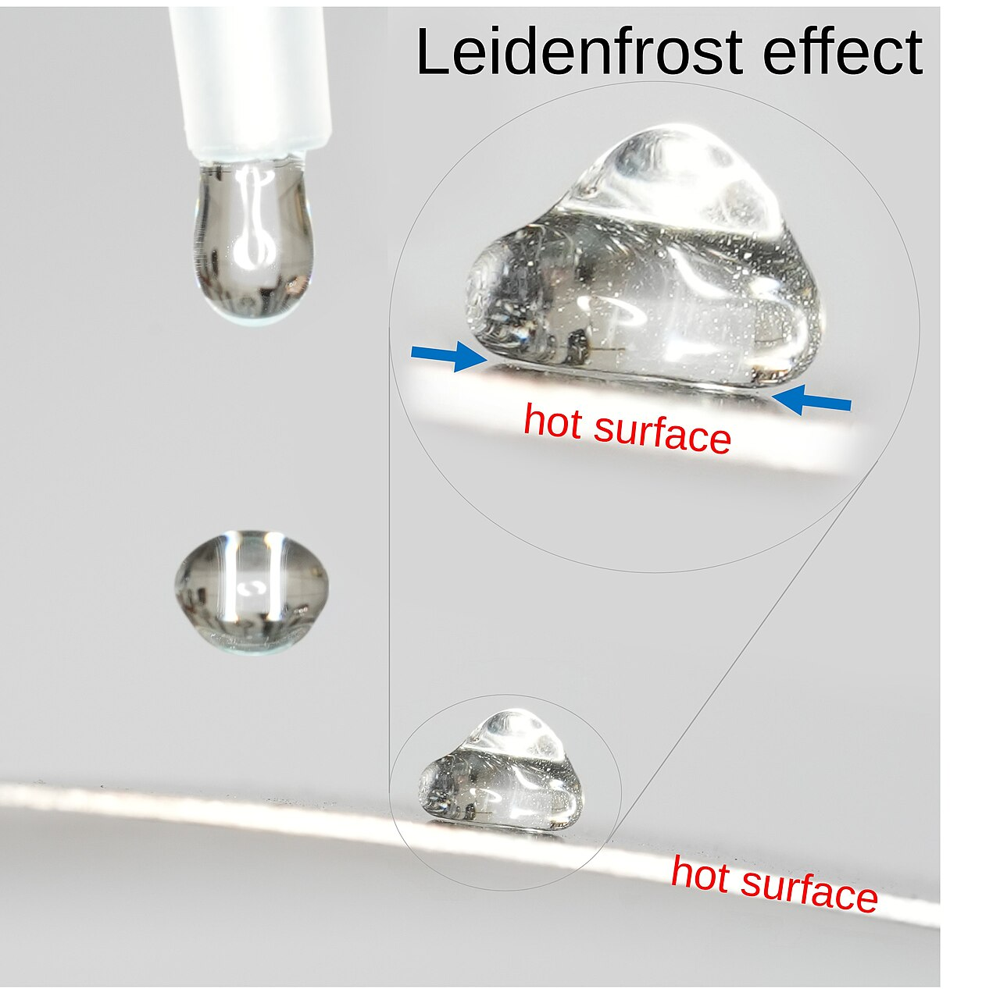

I had the chance to dive into the February 2025 issue of *PHP Architect*. While I personally found this issue slightly weaker compared to previous editions, it still offered valuable insights and thought-provoking pieces. Here’s my detailed breakdown:

---

## 1️⃣ The CMS Plateau by Andrew Woods

### Summary
Andrew Woods explores the current state of CMS platforms, arguing that we've hit a plateau in CMS innovation. He highlights how early CMS systems revolutionized content management but emphasizes the lack of meaningful progress today. Suggestions include better link management, HTTP status code usage, discoverability improvements, archiving capabilities, and Webmention support.

> "The amount of energy needed to refute bullshit is an order of magnitude bigger than to produce it." — *Brandolini’s Law* (quoted beautifully in the article)

### Commentary & Critique
This article mirrored my own perception perfectly—CMS development seems stuck. Woods does an excellent job pointing out areas needing innovation, particularly in link management, archiving, and accessibility. However, one crucial aspect I feel is missing: the rise of **low-code/no-code platforms**. Their growth is possibly a sign that traditional CMSs aren't the problem solvers they used to be.

📚 It reminded me of *The Lean Startup*—how cycles of innovation often hit a plateau when the market shifts, and it’s time to pivot.

### Pros ✅
- Great summary of CMS evolution and current stagnation.
- Highlights important improvements like link rot prevention and archiving.
- Strong ethical point referencing Brandolini’s Law.

### Cons ❌
- Misses the growing influence of low-code/no-code solutions.
- Could explore more technical CMS alternatives.

### Takeaways:
- Move beyond CRUD: innovate in link handling, accessibility, and discoverability.
- Look to integrate Webmention and robust archiving.
- Consider the broader shift towards no-code/low-code.

---

## 2️⃣ Distributed Tracing in PHP Using OpenTelemetry by Nelson Isioma

### Summary
Nelson provides a clear, practical introduction to distributed tracing using OpenTelemetry (OTel). He explains key concepts like spans, traces, and metrics and demonstrates how to integrate OTel into Laravel applications, visualizing traces with Zipkin.

> Observability lets you understand a system from the outside by letting you ask questions about that system without knowing its inner workings. Furthermore, it allows you to easily troubleshoot and handle novel problems, that is, “unknown unknowns”. It also helps you answer the question, “Why is this happening?”

### Commentary & Critique
This article hit home. Observability is something I believe **every dev team should embed in their mission**. Nelson makes the tooling approachable and shows how OpenTelemetry is becoming a **de facto standard**.

📚 Reflecting on *Clean Code*, it’s not just about readable code—it’s about observable, debuggable systems.

### Pros ✅
- Clear, beginner-friendly explanation of observability concepts.
- Practical Laravel integration examples.
- Highlights multiple OTel backends, including open-source options.

### Takeaways:
- Observability is crucial for performance, debugging, and resilience.
- OpenTelemetry + Laravel = smooth path to better monitoring.

---

## 3️⃣ Too Much Focus can be Detrimental by Eric Mann

By Dirk8B - Eigenes Werk, CC BY-SA 4.0, https://commons.wikimedia.org/w/index.php?curid=125883224

### Summary
Eric uses the example of a professor rediscovering the **Leidenfrost effect** to illustrate how over-specialization can limit creativity. He argues for becoming a T-shaped generalist, exploring outside one’s niche.

> Being a generalist also means studying other fields and learning the patterns and modes of operation that exist in those fields.

### Commentary & Critique
Loved the story! It resonates with my belief in **growth mindset** and the importance of cross-disciplinary learning.

### Pros ✅
- Engaging story to illustrate the danger of narrow focus.
- Encourages broader, interdisciplinary learning.

### Takeaways:
- Step outside your specialization regularly.
- Broader knowledge equals broader solutions.

---

## 4️⃣ Jumping into LLMs With Prism by Scott Keck-Warren

### Summary
Scott introduces **Prism**, a Laravel package simplifying LLM integration. He walks through generating basic outputs, structured responses, and tool calls.

### Commentary & Critique
While the article provides a solid introduction, I expected more depth—perhaps advanced prompt strategies or complex real-world examples. Still, a handy primer for Laravel devs.

### Pros ✅
- Easy-to-follow for Laravel users.
- Clear, practical LLM usage demo.

### Cons ❌
- Slightly shallow; lacks more advanced insights.
- Focuses solely on Laravel.

### Takeaways:
- Prism offers a quick entry point to LLM use in PHP apps.
- Keep learning—LLMs will become essential.

---

## 5️⃣ Anatomy of a Modern PHP Class by Chris Tankersley

### Summary
Chris outlines what a modern PHP class should look like, demonstrating PHP 8.4 features like typed properties, constructor promotion, and new syntactic sugar.

### Commentary & Critique
Excellent refresher. As a long-time PHP developer, I appreciate the focus on **clean, modern code**, much in line with *Clean Code* principles.

### Pros ✅
- Clear examples of current PHP best practices.
- Encourages clean, maintainable code.

### Cons ❌
- Geared more towards beginners and intermediate devs.

### Takeaways:
- Utilize PHP 8.4 features for concise, robust classes.
- Keep modernizing to avoid technical debt (but finish your project first 😉).

---

## 6️⃣ Powering PHP’s Growth (The Zend Engine) by Christopher Miller

### Summary
Christopher recounts the history of the Zend Engine, detailing its pivotal role in PHP's growth and evolution.

### Commentary & Critique
While informative, it felt more like **past knowledge**. Still useful for PHP newcomers.

### Pros ✅
- Solid historical overview.
- Great for developers new to PHP internals.

### Cons ❌
- Less relevant for seasoned PHP developers.

### Takeaways:
- Know your roots: the Zend Engine powers your PHP apps.

---

## 7️⃣ Story Maps by Edward Barnard

### Summary
Edward explores the technique of story mapping for agile planning, referencing XP principles like "Card, Conversation, Confirmation" to foster team understanding.

### Commentary & Critique
A valuable reminder that communication drives successful projects. Resonated strongly with my approach to team leadership.

### Pros ✅
- Practical, relatable explanation of story mapping.
- Connects agile planning with real teamwork.

### Cons ❌
- Could have included more tooling tips.

### Takeaways:
- Use story maps to visualize work and foster alignment.
- Keep user needs front and center.

---

## 8️⃣ Dockerized Client with PSR-6 HTTP Caching by Oscar Merida

### Summary
Oscar walks us through setting up a Dockerized PHP client using PSR-6 HTTP caching, plus configuring Xdebug and PHP extensions.

### Commentary & Critique
A great step-by-step guide. I especially liked how it avoided default tools like **Lando** or **DDev**, offering insight into manual setups. Still, I recommend exploring **Lando** or **DDev** for teams needing streamlined setups.

📚 It aligns well with *The Lean Startup*'s idea of fast iteration—Docker containers speed up experimentation.

### Pros ✅
- Thorough, clear instructions.
- Covers essentials like Xdebug and PSR-6 caching.

### Cons ❌
- Advanced users might prefer Lando/DDev for faster bootstrapping.

### Takeaways:
- Master Docker fundamentals, then layer tools like Lando/DDev.
- PSR-6 caching enhances performance and efficiency.

---

## 9️⃣ Adding Individuals With A Disability to Your Team by Maxwell Ivey

### Summary
Maxwell advocates for inclusivity, emphasizing the need to actively welcome people with disabilities into development teams.

### Commentary & Critique
Crucial message. It's humbling to consider how different life experiences can be—and how much teams benefit from them.

📚 It reminds me of the human-centered approach advocated in *Man’s Search for Meaning*—understanding others fosters better outcomes.

### Pros ✅
- Essential ethical and practical message.
- Encourages empathy and team strength.

### Cons ❌ 😅
- None. More of this, please!

### Takeaways:
- Prioritize inclusivity.
- Diverse teams build better software.

---

## 🔟 The Developer Experience by Chris Hartjes

### Summary
Chris debuts his column focusing on **Developer Experience (DX)**. He advocates for consistent tooling, shared IDE configurations, and streamlined onboarding mirroring the sentiments of [spotifys golden 🏅 path](https://engineering.atspotify.com/2020/08/how-we-use-golden-paths-to-solve-fragmentation-in-our-software-ecosystem/).

### Commentary & Critique
I couldn’t agree more—especially on having a **mono-culture for IDEs/editors**. It aligns beautifully with my philosophy of removing blockers and mental load to help teams achieve flow.

### Pros ✅
- Strong, practical tips.
- Great kickoff to a promising column.

### Cons ❌
- Could offer even more examples on DX tooling.

### Takeaways:
- Standardize tools to accelerate onboarding.
- Good DX = better developer happiness and output.

---

## 🚀 Final Thoughts

While this issue didn’t feel quite as strong overall as others, it still contained standout articles worth every PHP developer’s time. Highlights for me:

- The call to push past the CMS plateau.
- The growing momentum of observability practices.
- Actionable insights into Docker, LLMs, and inclusive teams.
- Reminders that developer experience and team communication should never be overlooked.

**Worth picking up—especially if you're interested in keeping your PHP skills sharp and broadening your thinking beyond the immediate code.**

**Keep reading, keep questioning, keep evolving.**

