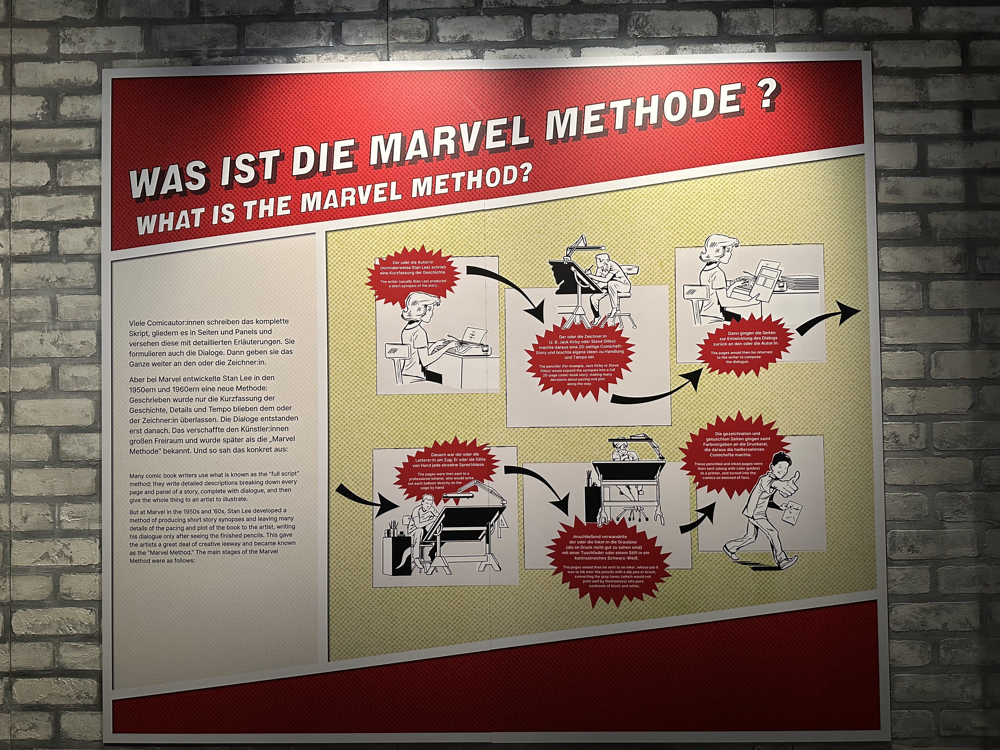

*Eine Hommage an Helden, Handeln und kreativen Flow*

## 🦸‍♂️ Ein Funke aus Kindheitstagen

Einige meiner frühesten Erinnerungen drehen sich um Superhelden. Ich habe nicht einfach nur Geschichten geschaut – ich habe Werte aufgesogen. Verantwortung. Widerstandskraft. Handeln statt Zögern. Während andere diskutierten, schwang sich Spider-Man in die Action. Während andere planten, *baute* Iron Man in einer Höhle einen Anzug.

Diese Helden haben mich geprägt. Bis heute bewundere ich Menschen, die **tun**, nicht nur **denken**.

## ⏳ Vor der Marvel-Methode: Die Ära des vollständigen Skripts

Um zu verstehen, wie revolutionär die Marvel-Methode war, muss man sich anschauen, was davor üblich war.

In den 1930er und 40er Jahren arbeiteten Comic-Autor:innen nach dem Prinzip des sogenannten *“full script”*: Jede einzelne Seite, jedes Panel, jede Bewegung, jeder Gesichtsausdruck wurde detailliert vorgeschrieben. Auch der Dialog entstand vorab. Erst danach kam der oder die Zeichner:in ins Spiel.

Das war eine klassische Top-down-Kette: Die Autor:innen planten alles durch, die Künstler:innen setzten es um. **Kreativität war strikt aufgeteilt**, oft limitiert, selten wirklich kollaborativ. Es war ein lineares Wasserfall-System – langsam, starr und anfällig für Reibung.

Und dann kam [Stan Lee](https://de.wikipedia.org/wiki/Stan_Lee).

## 📚 Die Entdeckung der Marvel-Methode

Letztes Wochenende besuchte ich die [Marvel-Ausstellung in Köln](https://www.eventim.de/event/marvel-die-ausstellung-universe-of-super-heroes-odysseum-19757364/) – ein Ausflug in meine Kindheit. Zwischen Originalzeichnungen und Superhelden-Ikonen stieß ich auf ein echtes Juwel: **[Die Marvel-Methode](https://en.wikipedia.org/wiki/Script_(comics)#Plot_script)**.

In den 1950er und 60er Jahren entwickelte Stan Lee eine völlig neue Arbeitsweise. Und sie liest sich heute wie ein agiles Manifest.

So funktionierte sie:

1. 📝 Der Autor oder die Autorin schrieb nur einen groben Handlungsrahmen – keine Panelbeschreibungen, keine Dialoge.
2. ✏️ Die Künstler:innen setzten die Geschichte grafisch um. Sie entschieden, wie viele Panels nötig waren, wie die Action aussieht, wie die Story fließt.
3. 💬 Erst danach kehrten die Autor:innen zurück – und schrieben die Dialoge basierend auf dem fertigen Artwork.
4. 🎯 Das Ergebnis: **ein dynamisches, co-kreiertes Produkt**, geformt von Vision *und* Umsetzung.

*Der Dialog kam später. Die Action kam zuerst. Die Kunst erzählte die Geschichte.*

Das war kein Trick, um Zeit zu sparen – es war ein kreatives Befreiungswerkzeug. Ein Prozess, der auf Vertrauen, Talent und Iteration setzte.

## 🧠 Idee vs. Umsetzung – das ewige Spannungsfeld

In der Tech-Welt wird gerne übergeplant. Ob in der klassischen Projektplanung oder mit überfrachteten Backlogs: Viele glauben, perfekte Planung führe zu perfekten Ergebnissen. Doch **[Perfect is the enemy of good](https://en.wikipedia.org/wiki/Perfect_is_the_enemy_of_good)**.

Agile Methoden und [Lean Startup](https://en.wikipedia.org/wiki/Perfect_is_the_enemy_of_good) wollten das ändern. Aber selbst dort wird oft vergessen:  
**[Make It Work, Make It Right, Make It Fast.](https://ecommerce-developer.de/solid-refactoring-als-technischer-leiter-einer-agentur/)**

## 🔄 Marvel vs. Wasserfall

Die klassische Comic-Erstellung entsprach dem Wasserfall-Modell: Erst denken, dann umsetzen.  
Die Marvel-Methode war das Gegenteil: Iterativ, dezentral, **vertrauensbasiert**.

Stan Lee hat nicht nur neue Helden geschaffen – er hat ein kollaboratives Produktionsmodell erfunden, das seiner Zeit weit voraus war.

## 🧪 Parallelen zur Tech-Welt

Ob in der Softwareentwicklung, im Agenturgeschäft oder in der Führung: Wir brauchen mehr Marvel-Methode.

- ✅ Vertrauen ins Team – nicht alles vorgeben.
- ✅ Ergebnisorientierung statt Planungswut.
- ✅ Handlung als Basis für Erkenntnis – nicht umgekehrt.

> “Plans are only good intentions unless they immediately degenerate into hard work.”  
> – *Peter Drucker*

Oder wie Stan Lee gesagt haben könnte 😅:  
_"Make mine Marvel – und fang endlich an zu zeichnen!"_

## 🎯 Fazit

Ich kam wegen der Nostalgie.  
Ich ging mit einem neuen Methodendenken.

Die Marvel-Methode hat mir wieder gezeigt:  
**Helden sind nicht die, die planen. Sondern die, die handeln.**

Und manchmal liegt die wahre Innovation nicht in der Idee –  
sondern darin, **dein Team mutig ins Tun zu bringen.**