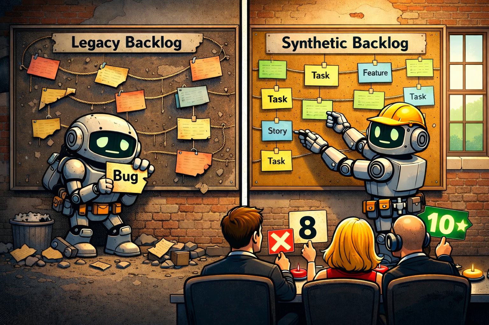

## Stop treating AI-generated backlog items as if they were already owned

If your team is already using GenAI, AI agents, or agentic workflows to turn meeting notes into backlog items, pause for a moment and ask one hard question:

**Who actually understands this backlog well enough to stay accountable for it?**

That is the question behind the buzzword I want to introduce: **Synthetic Backlog**.

## Legacy Code: responsibility without breathing understanding

Legacy Code is familiar territory for us as developers. It is code you still have to operate and change, even though the original intent, structure, or rationale is no longer really alive in the team.

It is not dangerous only because it is old. It is dangerous because responsibility remains while understanding decays.

That is why good engineers do not just touch legacy code. We read it, reconstruct intent, reduce ambiguity, and rebuild a workable mental model before trusting ourselves to change it.

## The bridge: from code truth to backlog truth

On the product side, teams have long suffered from a related problem. Not in source code, but in planning and decision artifacts.

A backlog can become the planning equivalent of legacy code: full of old wishes, stale assumptions, half-decisions, duplicates, and artifacts whose original meaning has evaporated. In agile practice, that is exactly why [backlog refinement](https://www.atlassian.com/agile/project-management/backlog-grooming) exists as a recurring activity to review, update, and reorder backlog items rather than treating the backlog as a passive archive.

And that matters even more if the backlog is not the final stop, but the starting point for the specs that later feed a [Spec-Driven Development](https://martinfowler.com/articles/exploring-gen-ai/sdd-3-tools.html) workflow.

## Legacy Backlog: yesterday's work logic haunting today's decisions

A Legacy Backlog is yesterday's work logic still haunting today's priorities.

It slows focus, blurs relevance, and creates a fake sense of optionality. Everything is still in the system, so everything looks somehow alive, even when it is not. Instead of helping the team decide, the backlog starts absorbing attention and generating noise.

The standard hygiene practices are well known for a reason. Review old entries. Remove duplicates. Close or archive stale items. Re-prioritize continuously. Keep only what still deserves near-term attention. Atlassian's guidance frames [backlog refinement](https://www.atlassian.com/agile/scrum/backlog-refinement) exactly around keeping items current, ordered, and fit for upcoming work rather than letting the backlog become an unmanaged storehouse.

## What changes with AI generation

AI changes the shape of the problem.

A backlog created or heavily expanded by an LLM is usually not stale because it is old. It becomes stale because it was **never truly mentally adopted** by the accountable humans around it.

That is the key difference.

Legacy Backlog is degraded by time.  
Synthetic Backlog is degraded by missing ownership at birth.

Anthropic's work on [context engineering](https://www.anthropic.com/engineering/effective-context-engineering-for-ai-agents) is useful here. They explicitly describe the shift away from prompt engineering alone toward the curation and maintenance of the right context, and they frame that work around building an effective mental model for steerable agents.

That maps almost perfectly onto backlog work. If AI helps generate backlog items from meetings, notes, or prior documents, then the critical work does not disappear. It moves into context curation, selection, condensation, and validation.

## Definition: what Synthetic Backlog means

**Synthetic Backlog is an AI-generated backlog that looks ready for execution, but is not sufficiently understood, curated, and mentally owned by the accountable humans around it.**

And because the backlog increasingly becomes the source from which specs for SDD are written, this is not just a ticketing problem. It is a truth problem.

If the backlog is synthetic and nobody really masters it, the specs downstream inherit that weakness. This is where the [Broken Windows Theory](https://pmc.ncbi.nlm.nih.gov/articles/PMC8059646/) is a useful analogy: one vague AI-generated backlog item becomes one vague spec, that vague spec normalizes the next shortcut, and before long the whole delivery chain starts accepting ambiguity as standard. The first broken window is rarely the catastrophe. The problem is that it tells the system: apparently this is okay here.

## Best practices: what Legacy Backlog handling already taught us

The good news is that many of the best practices for Legacy Backlog handling still work for Synthetic Backlog.

- **Prune aggressively**  
  Do not treat every generated item as sacred. Synthetic backlog items should earn their place. If an item is vague, duplicated, irrelevant, or clearly unsupported by the current direction, remove it. What stays in the backlog silently claims attention.

- **Reconstruct intent**  
  Ask the same question we ask in ugly code: what was this supposed to do, and why is it here? Every important generated item should be traceable back to a problem, decision, need, risk, or stakeholder signal. If that cannot be reconstructed, the item is not backlog truth yet.

- **Re-prioritize continuously**  
  AI can generate far faster than humans can decide. That means prioritization becomes even more important, not less. A backlog is not a transcript graveyard. It is an ordered expression of what matters now and next.

- **Merge duplicates and collapse noise**  
  Generated backlog items often multiply phrasing, not clarity. Similar statements from several meetings can easily become several seemingly distinct items. That creates false weight and fake consensus.

- **Keep the backlog close to real decisions**  
  The farther backlog items drift from actual human decisions, the more likely they are to become synthetic residue. Pull them back toward explicit choices, current goals, and active constraints.

- **Treat unclear items as unready**  
  Generated text often sounds more complete than it really is. Do not mistake fluency for readiness. We know this from code reviews too: something that looks polished can still be conceptually wrong.

- **Read before you trust**  
  This sounds trivial, but it is the heart of it. If an accountable person has not really read the backlog item, challenged it, and understood its place in the system, then the team is already operating on borrowed certainty.

- **Curate context before the next generation step**  
  Do not just dump another meeting transcript into the machine. Feed it condensed truth: goals, constraints, decisions, open questions, domain terms, and known tensions. Garbage in, synthetic backlog out.

## Product and architecture roles must get sharper

This is where things get politically interesting.

If AI increasingly shapes the first version of backlog content, role ambiguity becomes expensive.

The Product Owner is only one example. More broadly, whoever is accountable for product direction, delivery direction, or operational truth must hold the mental model of the backlog. That person may no longer write every item by hand. Fine. But they still need to understand the backlog deeply enough to explain it, challenge it, prioritize it, and authorize it.

The architect has a different role.

In an AI-native setup, the architect does not need to become the shadow author of the backlog. The architect can be human-in-the-loop or human-after-the-loop for technical validation: checking feasibility, dependencies, architecture fit, side effects, and systemic risk.

That is essential work.

But validation is not the same as authorization.

And this is also why many classical Scrum team assumptions will come under pressure. If AI delivers persuasive, pre-shaped backlog content at speed, fuzzy collective ownership becomes less helpful. The artifact arrives already structured. Someone still has to decide whether it is true, relevant, and worth building.

## The real requirement: accountable people must master the backlog truth

Anthropic's January 2026 research on [AI assistance and coding skills](https://www.anthropic.com/research/AI-assistance-coding-skills) points to the same tension from another angle: AI can increase productivity, but cognitive offloading can also reduce the human understanding needed for meaningful oversight and error detection.

That is not just a developer problem.

It is now a backlog problem too.

If the backlog is the basis from which specs for SDD are created, then the backlog becomes part of the operational truth of the project. And operational truth cannot remain healthy if nobody truly masters it.

## The closing challenge

Legacy Code taught us that accountability requires system understanding.

Legacy Backlog taught us that relevance requires ongoing curation.

Synthetic Backlog teaches us that **AI-generated backlog truth requires human mastery**.

And that final point should not be limited to the PO role.

Project-responsible humans, whatever their title, must still create a truth that can actually be governed. Even with AI in the loop, there has to be a backlog that is not merely generated, but understood. Not merely present, but mastered. Not merely persuasive, but owned.

As long as responsibility stays with humans, the backlog truth must stay governable by humans too.